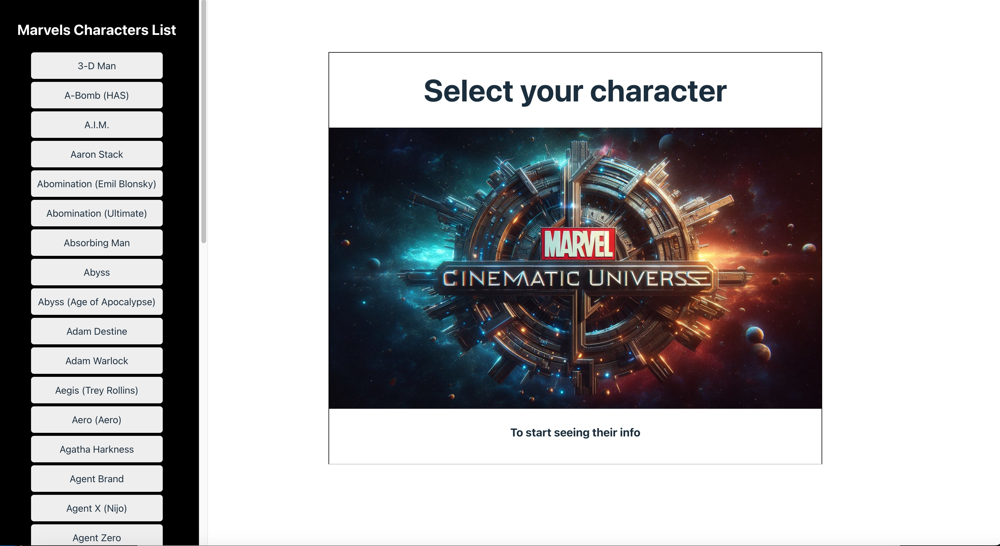
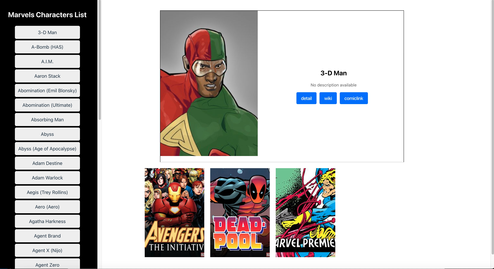
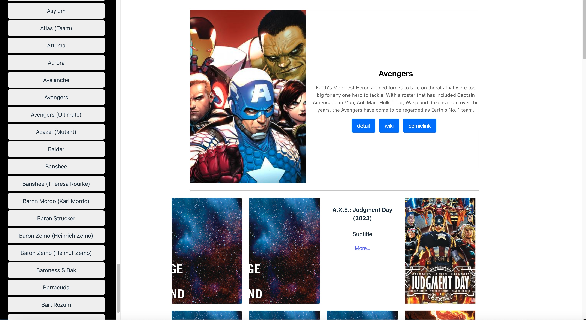

# Marvel Character Viewer

This is a simple web application for viewing Marvel characters and their associated series.

## Features

- Displays a list of Marvel characters.

- Allows clicking on a character to view their details and series.

- Shows a flip-card interface for each series associated with the selected character.

## Technologies Used

# React + Vite
- React.js
# API
- Marvel API

## Installation

1. Clone this repository to your local machine using `git clone`.
2. Navigate to the project directory.

## Usage

1. Install dependencies by running `npm install`.
2. Obtain an API key from the Marvel Developer Portal (<https://developer.marvel.com/>).
3. Create a `.env` file in the project root and add your API key as follows:
VITE_APP_ACCESS_KEY="your_api_key_here"
4. Start the development server by running `npm run dev`.
5. Open your browser and navigate to `http://localhost:5173` to view the application.
## Contributing

Contributions are welcome! Please feel free to submit any issues or pull requests.

## License

This project is licensed under the MIT License - see the [LICENSE](LICENSE) file for details.
